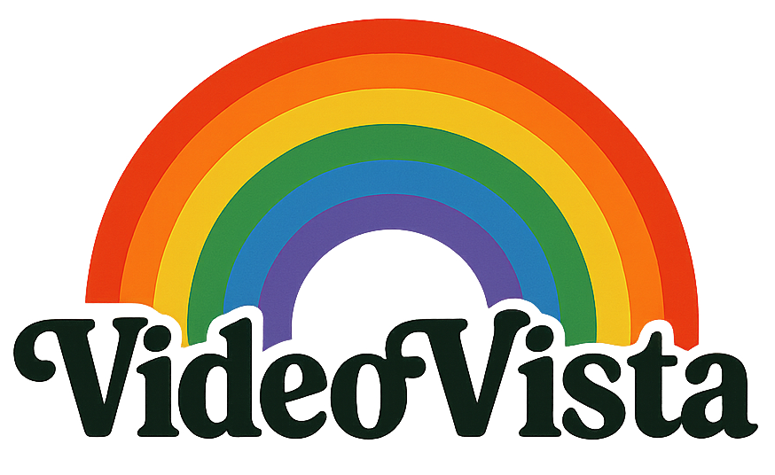

<div align="center">
  
</div>

#  VideoVista Family


<a src="https://img.shields.io/badge/cs.CV-2406.11303-b31b1b?logo=arxiv&logoColor=red" href="https://arxiv.org/abs/2406.11303"> 
</a> | 


If you appreciate our project, please consider giving us a star ⭐ on GitHub to stay updated with the latest developments.

## 🔥 News

**`2025.04.15`** 🚀 We release VideoVista-CulturalLingo, the first video evaluation benchmark designed to bridge cultural, linguistic, and domain divide in video comprehension. You can download this benchmark from [HuggingFace](https://huggingface.co/datasets/Uni-MoE/VideoVista-CulturalLingo).

**`2025.04.13`** 🎉 We move the previous VideoVista from [Uni-MoE](https://github.com/HITsz-TMG/UMOE-Scaling-Unified-Multimodal-LLMs) to here. It contains the [VideoVista (Evaluation), VideoVista-Train (Instruction Tuning), VideoVista-Event (Pertaining)](https://huggingface.co/collections/Uni-MoE/videovista-67f397b7eddc81cb207228a2)


## :page_facing_up: Citation
If you find this project useful in your research, please consider cite:
```bibtex
@misc{chen2025videovista,
      title={VideoVista-CulturalLingo: 360° Horizons-Bridging Cultures, Languages, and Domains in Video Comprehension}, 
      author={Xinyu Chen and Yunxin Li and Haoyuan Shi and Baotian Hu and Wenhan Luo and Yaowei Wang and Min Zhang},
      year={2025},
      eprint={},
      archivePrefix={arXiv}
}
```
