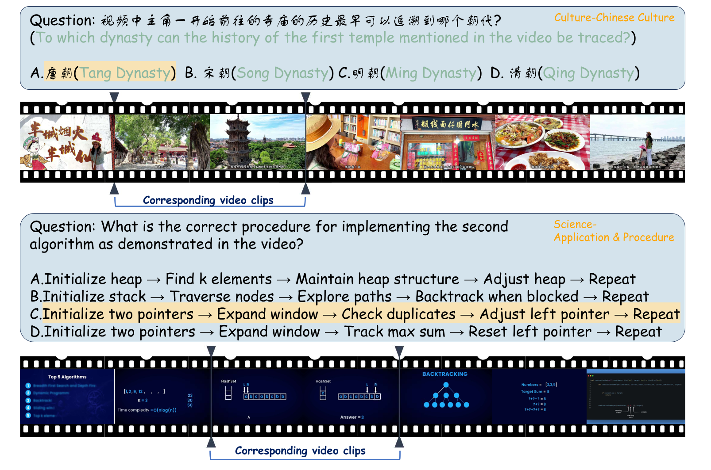

<div align="center">
  
</div>

# VideoVista-CulturalLingo: 360° Horizons-Bridging Cultures, Languages, and Domains in Video Comprehension 

<font size=2><div align='center' >  [[🌐 Project](https://videovista-culturallingo.github.io/)] [[🏆 Leaderboard](https://videovista-culturallingo.github.io/#leaderboard)] [[📄 arXiv]()] [[🤗 Huggingface](https://huggingface.co/datasets/Uni-MoE/VideoVista-CulturalLingo)] </div></font>
If you like our project, please consider giving us a star ⭐ on the repository to stay updated with the latest developments.

---
## 🔥 News

**`2025.04.23`** 🚀 We release VideoVista-CulturalLingo, the first video evaluation benchmark designed to bridge cultural, linguistic, and domain divide in video comprehension. You can download this benchmark from [HuggingFace](https://huggingface.co/datasets/Uni-MoE/VideoVista-CulturalLingo).

## 🌟 VideoVista-CulturalLingo Overview

Assessing the video comprehension capabilities of multimodal AI systems can effectively measure their understanding and reasoning abilities. Most video evaluation benchmarks are limited to a single language, typically English, and predominantly feature videos rooted in Western cultural contexts.

We introduce **VideoVista-CulturalLingo**, the first video evaluation benchmark designed to bridge cultural, linguistic, and domain divide in video comprehension. Our work differs from existing benchmarks in the following ways: 
1. **Cultural diversity**, incorporating cultures from China, North America, and Europe;
2. **Multi-linguistics**, with questions presented in Chinese and English—two of the most widely spoken languages; 
3. **Broad domain**, featuring videos sourced from hundreds of human-created domains. VideoVista-CulturalLingo contains 1,389 videos and 3,134 QA pairs, and we have evaluated 24 recent open-source or proprietary video large models.

## 🔍 Dataset Example
<div align=center></div>

## 🌈 Evaluation

You can download the JSON file and VIDEOS from [Huggingface]().

When downloading videos, you may need to download all the zip files with different suffixes. After that, just extract the file using follow command.
```shell
cat videos.zip.* > combined_videos.zip
unzip combined_videos.zip
```

We provide the calculation scripts in [Evaluation Code](Dataset_Collection/VideoVista-CulturalLingo/evaluation), you need include key "question_id" and "pred" in your result file and store in json format.

```shell
cd Dataset_Collection/VideoVista-CulturalLingo/evaluation
python evaluate.py --results_file your_result_json --results_file VideoVista-CulturalLingo.json
```

## :yum: Leaderboard

Details about more baselines are shown in [🏆 Leaderboard](https://videovista.github.io/#leaderboard)

<!-- | Model                  | Language Model | Frames | Unders. | Reason. | Overall |
|------------------------|----------------|--------|---------|---------|---------|
| VideoChat+ChatGPT | gpt-3.5-turbo  | 40     | 16.64   | 23.04   | 17.99   |
| Video-LLAMA      | Vicuna-7B      | 16     | 25.40   | 25.16   | 25.35   |
| Video-ChatGPT     | Vicuna-7B      | 100    | 36.09   | 38.73   | 36.65   |
| IVA                | Vicuna-7B      | 200    | 37.38   | 48.38   | 39.70   |
| Video-LLAVA      | Vicuna-7B      | 8      | 53.82   | 66.91   | 56.59   |
| LLAMA-VID         | Vicuna-7B      | 1 fps  | 54.00   | 67.61   | 56.87   |
| LLAVA-NeXT-Video   | Vicuna-7B      | 16     | 54.12   | 66.14   | 56.66   |
| VideoChat2-Vicuna  | Vicuna-7B      | 16     | 51.79   | 60.55   | 53.64   |
| VideoChat2-Mistral | Mistral-7B     | 16     | 54.91   | 65.95   | 57.24   |
| Gemini-1.5-Flash       | Gemini         | 1 fps  | 74.73   | 82.30   | 76.39   |
| GPT-4o (**Best** :rocket:)                | GPT-4o         | 100    | **75.15**   | **87.97**   | **78.26**   | -->

| **Model**                  | **LLM**                   | **Frames**        | **Overall** | **Event** | **Object** | **Culture** | **Science** |
|---------------------------|---------------------------|-------------------|-------------|-----------|------------|-------------|-------------|
| **_Open-source Video LMMs_** |                           |                   |             |           |            |             |             |
| ShareGPT4Video            | Vicuna-7B-v1.5            | 16f              | 25.6        | 23.2      | 18.9       | 31.4        | 34.1        |
| VideoChat2-Mistral        | Mistral-7B-Instruct-v0.2  | 16f              | 29.6        | 27.5      | 25.9       | 34.7        | 33.1        |
| Video-LLaVA               | Vicuna-7B-v1.5            | 8f               | 38.2        | 42.2      | 34.4       | 34.5        | 41.1        |
| VideoLLaMA2               | Mistral-7B-Instruct-v0.2  | 32f              | 31.4        | 33.6      | 23.3       | 34.9        | 36.6        |
| LLaVA-OneVision           | Qwen2-7B-Instruct         | 32f              | 41.8        | 43.9      | 33.8       | 38.8        | 53.5        |
| MiniCPM-V 2.6             | Qwen2-7B-Instruct         | 1fps(64)         | 42.9        | 44.1      | 24.1       | 49.4        | 62.9        |
| mPLUG-Owl3                | Qwen2-7B-Instruct         | 1fps(128)        | 49.9        | 54.4      | 41.9       | 45.0        | 60.1        |
| Oryx-1.5                  | Qwen2.5-7B-Instruct       | 128f             | 41.4        | 43.8      | 32.2       | 37.6        | 55.8        |
| LLaVA-Video               | Qwen2-7B-Instruct         | 1fps(64)         | 51.0        | 57.9      | 39.1       | 48.8        | 60.3        |
| Qwen2-VL                  | Qwen2-7B-Instruct         | 1fps(300)        | 49.7        | 50.1      | 33.8       | 54.8        | 68.0        |
| InternVL2.5               | Internlm2.5-7b-Chat       | 64f              | 52.0        | 56.5      | 35.5       | 56.1        | 65.7        |
| MiniCPM-o 2.6             | Qwen2.5-7B-Instruct       | 1fps(64)         | 49.0        | 52.9      | 28.5       | 55.9        | 67.1        |
| TPO                       | Qwen2-7B-Instruct         | 1fps(96)         | 50.6        | 57.2      | 37.8       | 49.6        | 60.4        |
| InternVideo2.5           | Internlm2.5-7b-Chat       | 1fps(512)        | 52.0        | 52.5      | 38.1       | _**58.2**_  | 65.9        |
| VideoLLaMA3               | Qwen2.5-7B-Instruct       | 1fps(180)        | _**60.7**_  | _**58.0**_| **66.4**   | 53.1        | 64.4        |
| Qwen2.5-VL-7B             | Qwen2.5-7B-Instruct       | 1fps(300)        | 54.3        | 56.7      | 38.9       | 55.2        | _**73.3**_  |
| Qwen2.5-VL-72B            | Qwen2.5-72B-Instruct      | 1fps(300)        | **61.3**    | **61.0**  | 40.5       | **71.2**    | **83.3**    |
| **_Proprietary LMMs_** |                     |               |             |           |            |             |             |
| GPT-4o-2024-11-20      | GPT-4o              | 1fps(128)     | 56.7        | 53.4      | 38.2       | **68.0**    | 78.3        |
| Gemini-1.5-Flash       | Gemini-1.5-Flash    | 1fps          | 69.4        | 70.0      | 65.8       | 59.0        | 84.7        |
| Gemini-2.0-Flash-Lite  | Gemini-2.0-Flash-Lite | 1fps        | 70.7        | 63.1      | 71.6       | 63.1        | 82.1        |
| Gemini-2.0-Flash       | Gemini-2.0-Flash    | 1fps          | **76.3**    | **74.0**  | **77.1**   | **68.0**    | **87.4**    |


## Citation

If you find VideoVista useful for your research and applications, please cite using this BibTeX:
```bibtex
@misc{li2024videovista,
      title={VideoVista: A Versatile Benchmark for Video Understanding and Reasoning}, 
      author={Yunxin Li and Xinyu Chen and Baotian Hu and Longyue Wang and Haoyuan Shi and Min Zhang},
      year={2024},
      eprint={2406.11303},
      archivePrefix={arXiv}
}
```
